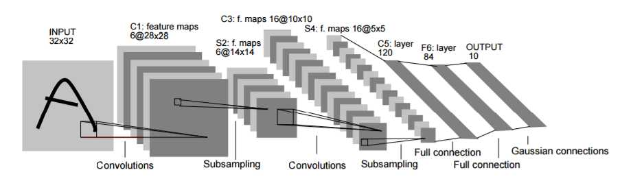

# Deep Learning Model Gallery
Implementation of various popular Deep Learning models and architectures. 

## LeNet
**Paper**: [Gradient-based learning applied to document recognition] (http://yann.lecun.com/exdb/publis/pdf/lecun-01a.pdf) (1998)

**LeNet or LeNet-5** (because it has 5 layers that contain parameters) is the most basic form of Convolutional Neural Network (CNN) architecture. It was first used for handwritten digit recognition ([MNIST](http://yann.lecun.com/exdb/mnist/) dataset)

**Architecture Summary**

|      Layer      |  Kernel Size | Number of Filter | Stride | Padding | Activation Function |  Output Size |
|:---------------:|:------------:|:----------------:|:------:|:-------:|:-------------------:|:------------:|
|      Input      |  32 x 32 x 3 |                  |        |         |                     |              |
|   Convolution   |     5 x 5    |         6        |    1   |    0    |          -          |  28 x 28 x 6 |
|     Maxpool     |     2 x 2    |         -        |    2   |    0    |       sigmoid       |  14 x 14 x 6 |
|   Convolution   |     5 x 5    |        16        |    1   |    0    |          -          | 10 x 10 x 16 |
|     Maxpool     |    2 x 2     |         -        |    2   |    0    |       sigmoid       |  5 x 5 x 16  |
| Fully Connected |      120     |         -        |    -   |    -    |          -          |      120     |
| Fully Connected |      84      |         -        |    -   |    -    |          -          |      84      |
| Fully Connected | 10 (classes) |         -        |    -   |    -    |       softmax       |      10      |

| Framework   | PyTorch | TensorFlow |
|-------------|---------|------------|
| Implemented |   [:white_check_mark:](lenet_pytorch.py)  |   :ballot_box_with_check: |

